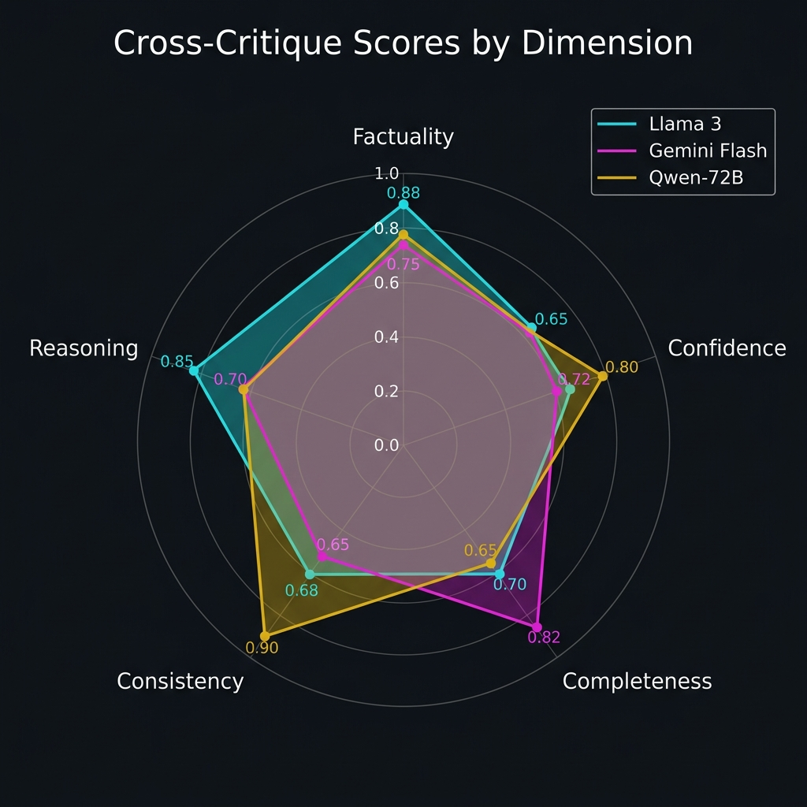
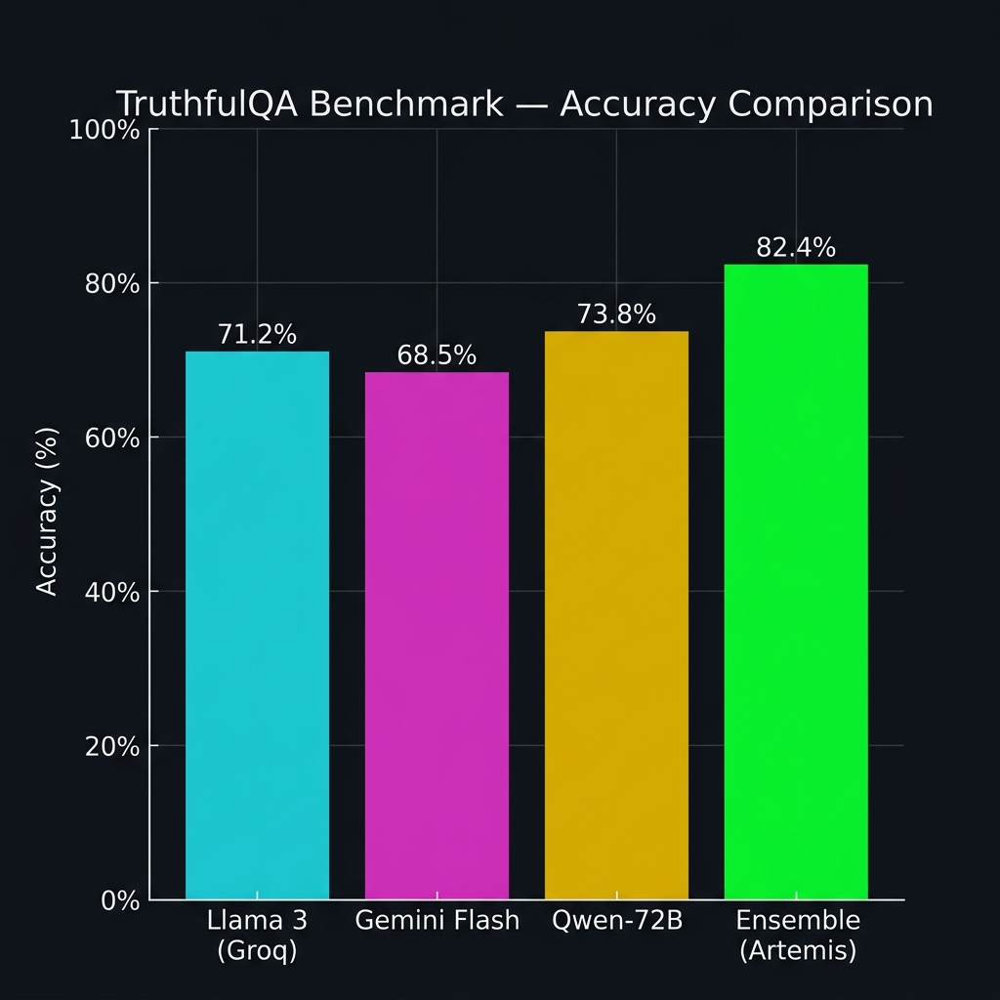

<p align="center">
  
</p>

<h1 align="center">Artemis Consensus</h1>

<p align="center">
  <em>One model is an opinion. Three is research.</em>
</p>

<p align="center">
  <a href="#quick-start">Quick Start</a> •
  <a href="#how-it-works">How It Works</a> •
  <a href="#scoring">Scoring</a> •
  <a href="#benchmarks">Benchmarks</a> •
  <a href="#configuration">Configuration</a>
</p>

---

## What Is This?

Artemis Consensus is a **multi-LLM ensemble system** that doesn't trust any single AI model to give you the right answer.

Instead, it does something smarter:

1. **Asks three models the same question** — Llama 3 (via Groq), Gemini Flash, and Qwen-72B (via HuggingFace) — all at the same time.
2. **Has each model critique the others** — every model scores and reviews the other models' answers across five quality dimensions.
3. **Detects when the models disagree** — using TF-IDF cosine similarity to flag conflicting responses before you ever see them.
4. **Synthesizes one final answer** — pulling the best, most accurate parts from each response, fixing errors the critiques found, and citing which model contributed what.

The result is a single answer you can actually trust, with a confidence label and full transparency into how it was built.

---

## Quick Start

### Prerequisites

- Python 3.10+
- API keys for [Groq](https://console.groq.com/), [Google Gemini](https://aistudio.google.com/), and [HuggingFace](https://huggingface.co/settings/tokens)

### Installation

```bash
git clone https://github.com/umran666/Artemis-Consensus.git
cd Artemis-Consensus
pip install -r requirements.txt
```

### Environment Setup

Create a `.env` file in the project root:

```env
GROQ_API_KEY=your_groq_key_here
GEMINI_API_KEY=your_gemini_key_here
HUGGINGFACE_API_KEY=your_huggingface_key_here
```

### Launch

```bash
streamlit run app.py
```

The sidebar will show you a live status of which API keys are connected before you run anything.

---

## How It Works

### Step 1 — Parallel Generation

All three models receive your question simultaneously via `asyncio.gather()`. No model waits for another — they run in parallel for speed.

| Model | Provider | Default Model ID |
|-------|----------|-------------------|
| Llama 3 (70B) | Groq | `llama-3.3-70b-versatile` |
| Gemini Flash Lite | Google | `gemini-2.5-flash-lite` |
| Qwen 72B Instruct | HuggingFace | `Qwen/Qwen2.5-72B-Instruct` |

### Step 2 — Disagreement Detection

Before critiquing, the system checks: **do the models even agree?**

It vectorizes all answers using TF-IDF, computes pairwise cosine similarity, and flags a disagreement if the average similarity drops below `0.6`. When this happens, you'll see a warning in the UI — a heads-up that the question might be contentious or nuanced.

### Step 3 — Cross-Critique

This is where Artemis gets interesting. Each model evaluates the *other* models' answers — not its own. The critique produces a structured JSON score across five dimensions (more on that below), plus written feedback identifying the biggest weakness.

The scores from all critics are averaged per target model, giving you a fair, multi-perspective evaluation.

### Step 4 — Synthesis

The highest-scoring answers are fed to a synthesizer model along with all critique feedback. It produces one final answer that:

- Pulls the **most accurate parts** from each response
- **Fixes factual errors** identified during critique
- Includes **inline citations** like `[Llama 3 (Groq)]` so you know where each fact came from
- Treats all model answers as **untrusted evidence** — prompt injection inside model responses is explicitly rejected

---

## Scoring

Every answer is evaluated on five dimensions, each weighted to reflect its importance:

| Dimension | Weight | What It Measures |
|-----------|--------|------------------|
| **Factuality** | 35% | Are the claims accurate and well-supported? |
| **Completeness** | 20% | Does it fully address the question? |
| **Confidence** | 15% | Is the confidence level appropriate — not over or under? |
| **Consistency** | 15% | Is the answer internally coherent? |
| **Reasoning** | 15% | Is the logic sound and well-structured? |

These combine into a **weighted total** that maps to a confidence label:

| Score Range | Label |
|-------------|-------|
| ≥ 0.80 | 🟢 **High Confidence** |
| ≥ 0.60 | 🟡 **Medium Confidence** |
| ≥ 0.40 | 🟠 **Low Confidence** |
| < 0.40 | 🔴 **Needs Verification** |

---

## Sample Output

Here's what an evaluation looks like when Artemis processes a question through all three models:

### Critique Scores — Radar Chart

Each model is scored across the five quality dimensions by the other models. The radar chart below shows how scores compare at a glance:

<p align="center">
  
</p>

### Benchmark Accuracy — Ensemble vs Individual

The ensemble consistently outperforms any single model. Below is a sample TruthfulQA run showing individual model accuracy versus the synthesized Artemis answer:

<p align="center">
  
</p>

> **Key takeaway:** The ensemble doesn't just pick the best model — it combines the strengths of all three, producing answers that are more accurate than any individual contributor.

---

## The Streamlit UI

The interface is organized into five tabs:

| Tab | What You See |
|-----|-------------|
| **Final Answer** | The synthesized answer with a confidence badge and disagreement warning |
| **Model Responses** | Each model's raw output with success/failure status and latency |
| **Critique** | Written feedback from each critic explaining weaknesses |
| **Scores** | Heatmap table + line chart comparing all models across the five dimensions |
| **Metrics** | Total latency, total tokens, and a per-model performance breakdown |

---

## Benchmarks

You can evaluate the ensemble against standard datasets from the command line:

```bash
# TruthfulQA — tests factual accuracy
python run_benchmarks.py --benchmark_name truthfulqa --samples 100

# GSM8K — tests mathematical reasoning
python run_benchmarks.py --benchmark_name gsm8k --samples 50
```

Results are saved as CSV files to `data/results/` with a summary printed to the console, including per-model and ensemble accuracy.

---

## Project Structure

```
Artemis-Research/
│
├── app.py                      # Streamlit UI entry point
├── config.yaml                 # All tuneable parameters
├── requirements.txt            # Python dependencies
├── run_benchmarks.py           # CLI benchmark runner
├── .env                        # API keys (not committed)
│
├── Models/
│   ├── base.py                 # Abstract base class + ModelResponse
│   ├── groq.py                 # Groq / Llama 3 integration
│   ├── gemini.py               # Google Gemini integration
│   └── huggingface.py          # HuggingFace Inference API
│
├── pipeline/
│   ├── ensemble.py             # Core orchestrator — runs the full pipeline
│   ├── critique.py             # Cross-critique logic and prompt engineering
│   ├── scorer.py               # Score dataclass and JSON response parser
│   └── synthesis.py            # Final answer generation with citations
│
├── evaluation/
│   └── benchmark.py            # TruthfulQA & GSM8K evaluation harness
│
├── data/                       # Benchmark output directory
├── images/                     # Architecture diagrams and assets
├── logs/                       # Runtime logs
└── utils/                      # Extensible utility modules
```

---

## Configuration

Everything tuneable lives in `config.yaml`:

```yaml
pipeline:
  mode: cross_critique          # critique strategy
  disagreement_threshold: 0.6   # cosine similarity cutoff
  timeout_seconds: 30           # per-model timeout
  retry_attempts: 2             # retries on failure

scoring:
  weights:
    factuality: 0.35
    confidence: 0.15
    completeness: 0.20
    consistency: 0.15
    reasoning: 0.15

evaluation:
  benchmarks: [truthfulqa, gsm8k]
  sample_size: 100
  output_dir: data/results
```

---

## Built With

| What | Why |
|------|-----|
| **Streamlit** | Interactive research UI without frontend overhead |
| **asyncio** | Parallel model calls — no waiting in sequence |
| **scikit-learn** | TF-IDF + cosine similarity for disagreement detection |
| **Matplotlib & Pandas** | Score visualisation and data handling |
| **HuggingFace Datasets** | Standard benchmark datasets (TruthfulQA, GSM8K) |
| **Loguru** | Structured logging |
| **python-dotenv** | Secure API key management |

---

## License

This project is intended for research and educational purposes.

---

<p align="center">
  <sub>Artemis Consensus — because the best answer is the one that survives peer review.</sub>
</p>
